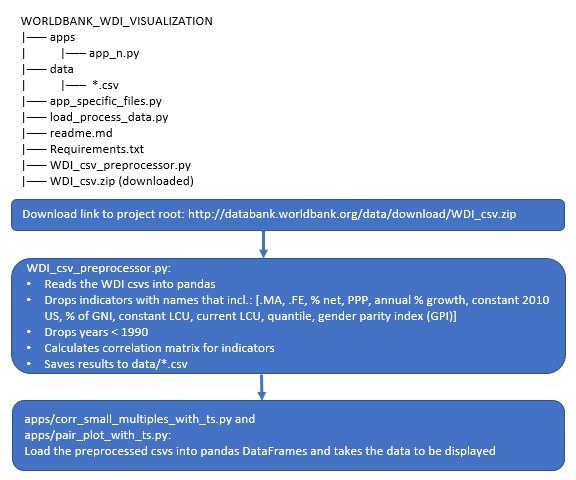

# Visualization Dashboard for World Bank's World Development Indicators

## To run visualization
#### get the data
goto: [http://databank.worldbank.org/data/download/WDI_csv.zip]

copy into project root

#### To setup environment
    $ pip install -r requirements.txt

#### To load visualization
    $ python index.py

#### open in browser
    http://127.0.0.1:8050/

## License
Standard MIT. See LICENSE.txt

## 1. Introduction
The [World Bank's World Development Indicators](http://datatopics.worldbank.org/world-development-indicators/) dataset comprises 1431 world development indicators (WDI), from 1960 to present, for 264 countries and aggregations by region, income, etc. The task was to develop an interactive visualization tool that allowed for explorations of the dataset. Specifically, to determine which WDIs effect the WDI of interest. This was broken down into two sub-tasks, determining which WDIs correlate with the WDI in focus and if these WDIs are leading or trailing indictors.

## 2. Method
The data was obtained as a csv file via download from [http://databank.worldbank.org/data/download/WDI_csv.zip](http://databank.worldbank.org/data/download/WDI_csv.zip). Preprocessed in a jupyter notebook ('Exploration_Small.ipynb') to make the dataset smaller, more complete and precompute the correlation matrix. Many of the indicators are different representations of the same data, eg, '% of GDP', '% of GNI' and 'constant 2010 US$', or broken down into population demographics, eg, male, female or age brackets. Additionally, in the period 1960-1989 much of the data was missing. Thus the size of the dataset was reduced by retaining only those with 'current US\$' and '% of GDP', dropping male and female subsets (keeping the total) and all data from years 1960-1989. The final 'small' dataset had 936 indicators spanning 30 years for all 264 countries and aggregates, resulting in ~7.5 million fields of which ~4 million were NaN, leaving ~3 million records.

The first subtask was relatively straight forward, requiring a calculation of Pearsons correlation between all indicators; however there are two facets to the data, namely countries and time. Thus the data was aggregated over time using the mean value. The aggregation partially solved the problem of missing values though many still remained. The remaining missing values were filled with the median value for each indicator. The absolute value of the resulting matrix of correlations could then be sorted by the indicator in focus to find the most highly correlated indicators. Statistical significance was tested by comparing the Pearson co-efficient against a table of critical values for a given degree of freedom and assigned to the conventional star rating of *** (0.001), ** (0.01), * (0.05). The chosen visualization was pairwise plots of the top k correlated variables, where each point represented a country/aggregated countries colored by region/AGG.

The second subtask of determining if the indicator was an effect or symptom was done by visual comparison of pairs of indicators in time. Obviously, this doesn't lend itself to probability testing and could be improved with at least doing some linear fitting of centre scaled data versus time and determining which indicator over all countries comes first. However, due to time constraints this has been left for future development (perhaps by the time of the presentation).

The dataset also includes broad categories into which the indicators are assigned. These categories were used to filter the data.

Find project at [https://github.com/clincolnoz/WorldBank_WDI_Visulization.git](https://github.com/clincolnoz/WorldBank_WDI_Visulization.git)

Required packages can be found in requirements.txt

*Figure 1 Project structure and data flow*

*Figure 2 Screen shot of dashboard*